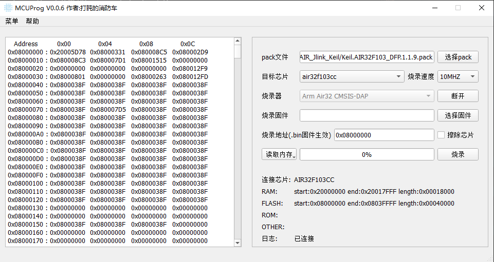

**English** | [中文](./README_zh.md) 

# MCUProg

## Introduction

MCUProg is a MUC programming host computer software based on pyocd+PySide6 (this software is only used to learn pyocd and PySide6 practice projects, if it can help you, it is a great honor, you can also modify it at will)

**If you encounter any problems with use, please give feedback in time**

## Software Architecture

pyocd: 0.36.0
PySide6: 6.7.0

## Support features

- support daplinkv1、daplinkv2、stlink、jlink programmer 

- Support Windows 10 or above, support Linux system (Ubuntu test)

- Support custom local pack file to support custom chip

- Support reading chip data

- Support reading and burning firmware data (currently support bin, hex, ELF, AXF will be supported later)

- Support optional erasing chip during programming

- The bin firmware can be used to customize the programming address

## LINUX Instructions

Linux to install the driver,The driver is in the [udev](./udev/) directory of the repository,Instructions for [pyocd Linux driver installation](./udev/README.md)

## Precautions

If the programming fails, please check the following points

1. Whether the connection between the programmer  and the chip is normal
2. Whether the target chip is selected correctly
3. Whether the chip supports the selected programming speed
4. Whether there is an interruption to the download, such as unplugging the USB operation
5. In other cases, please try to restart the software, if it cannot be solved, please give feedback in time

## Software Presentation

